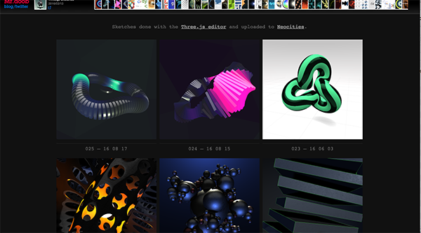

#Welcome to the Internet Technology 
- [Introducing the Unit team](#unit-team)
- [About the Unit](#about-the-unit) 
- [About the Assessment](#about-the-assessment)
- [Course Schedule](#course-schedule)
- [Why This Unit Is Exciting](#why-this-unit-is-exciting)
- [Course Progression](#course-progression)
- [Useful Resources](#useful-resources)
- [Further Information](#further-information)

#Unit Team

- Joe Appleton – Unit leader
	- Lecturer in Programming (web)
	- 10 years industry experience specialising in programming web applications
	
 - 10 years industry experience specialising in programming web
 - Found and sold one tech business (a financial marketing platform)
 - Currently involved in several technical web projects 
 		- Livelifechange.co.uk (an online fitness challenge) 
 		- Portvisitor.org  (a port information service)	  
- Darren Cunningham - Tutor
	- Lecturer in Computing 
	- Industry web experience 
	- 4 Years lecturing experience  		

#About the Unit 
- 10 Credits
- Assessment consists of a single TCA
- Provides a foundation in enabling technologies for the Internet focusing on:
	- HTML
	- CSS
- Focus on the client side technologies 
- Usability and requirements of designing to standards as established by the W3C organisation

#Unit delivery

-   A 1 hour lecture each week
-   The lecture will be complemented by a 2 hour practical

#Assessment Strategy 

The assessment will take place in the form of a single TCA, which will take place in mid January 2017 **(date to be confirmed)**

#Why This Unit Is Exciting 

There’s a huge demand for the skills covered
	
- 680 million websites live on the web 
- Thousands more being added daily

###A couple of amazing creative HTML examples 

HTML5 is no longer static, it allows us to create feature rich stunning graphical applications. The potential of HTML and what we can achieve is still very much untapped:

**[http://histography.io/](http://histography.io/)**

>> A timeline from the Big Bang to present day
 

**[http://mrdoob.com/](http://mrdoob.com/)**

>> A showcase of some of the latest HTML graphical development

#Course Progression 

#Useful Resources
[W3 Schools](http://www.w3schools.com/html) - offers a very comprehensive introduction to HTML.

#Further Information

- Attend all classes and please arrive on time!
- Prior knowledge and skills varies across students
- Not allowed to use Dreamweaver, Frontpage etc. for your web development
- Update your work regularly on University’s network drive

