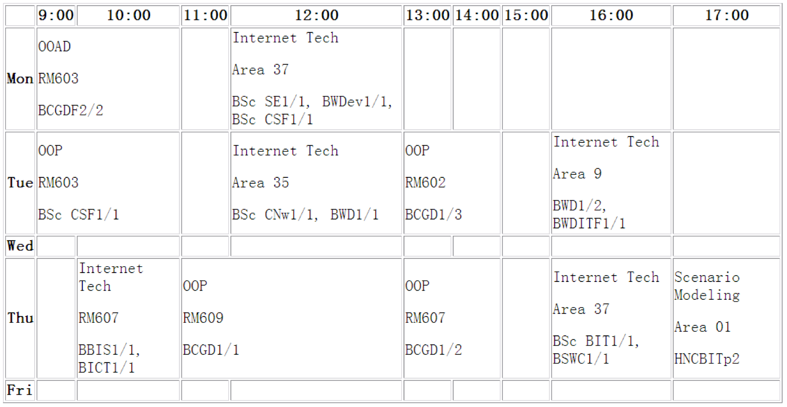
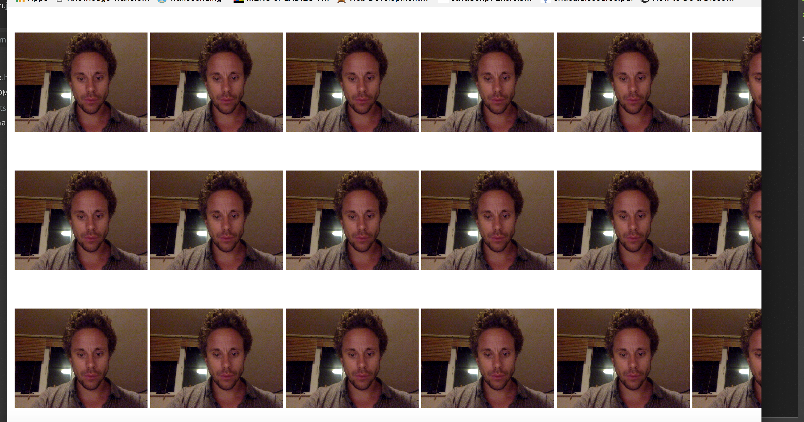

#Internet Technology Week 2 Practical

 
##1. Create your timetable

Create a new file called `timetable.html` and save it in the folder
`session2` on your [cloud9](https://c9.io/) instance. Recreate your timetable using the table tags and attributes discussed in todays the lesson. It should resemble the example below:

Remember, you can use ` ` or `
` tags to create new lines. You can also wrap text in the `<strong>..</strong>` tags to create a bold effect. It's fine to use these tags within a `<td>`, `<th>` table cell.  

##2. Validate your work so far
Use the [W3C Validator](https://validator.w3.org/) to ensure all your work so far is valid. 

##3. Advanced optional task 

**This task uses the power of HTML5 video and GitHub**

**Note**, I don't provide information in the notes on how to do this. You need to read around the task items in order to complete this task:

- Install git on your computer  [git download](https://git-scm.com/)
- Sign up to [GitHub](www.github.com)
- Work out how to create a [https://pages.github.com/](https://pages.github.com/). Your work should be published to gitHub pages.
- Investigate how to embed a live webcam video into a HTML page. You can start [here](https://www.html5rocks.com/en/tutorials/getusermedia/intro/)
- Using a table create a webcam mosaic like mine below:

- Publish your work to gitHub pages
- Email me the link (joe.appleton@solent.ac.uk). 
- Pat yourself of the back, you're well ahead of the curve 

