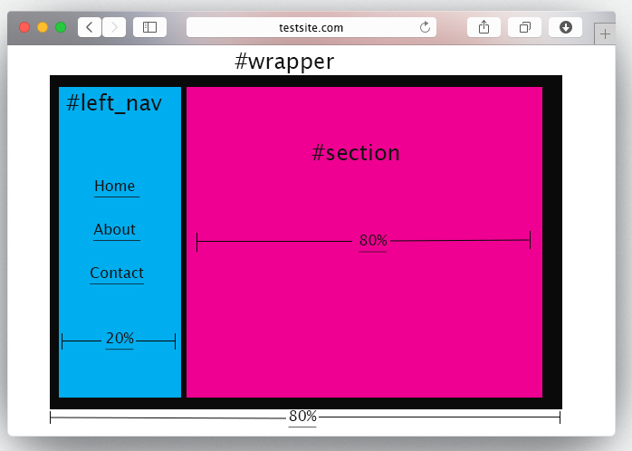

#Session 4 Tasks
Please only use external styles for this task. 

##Task 1  - Style up your week one page

**Set up**  

* Inside your `internet_tech` directory create a `session4` folder. 
* Copy your webpage from **session1** into the `session4` folder you just created. 
* Create a new style sheet and `<link>` it into your webpage. It's a good idea to place the style sheet in a new folder e.g. `css`. 

**Let's make your page look a little but more presentable**

Please go wild and style the page as much as you like, but as a minimum I want to see you complete the below tasks. Once done your page should resemble the layout below:

* Section up your site using a minimum of 3 `
's `#left_nav`, `#section` and `#wrapper` which holds all the content.
* To start with give `#left_nav` a width of **20%** and `#section` a width of **80%**.
* Give `#wrapper` a width of **80%** and centre align it using `#wrapper {margin: 0 auto;}` 
* Add a different `background-color` to  `#left_nav` and `#section`.
* Use `float` to position  `#left_nav` and `#section` side by side, as per the mock up above. 
* Use a `<ul>...</ul>` to create a basic navigation list in `#left_nav`. Have at least 3 links, but you don't need to create the corresponding pages. Here's how to create a placeholder link: `<a href="#">  Home </a>`
* Apply some pseudo classes to your links, so they change colour based on their status. Below is an example: 

		     a:link {color:#FF0000;}      /* unvisited link */   
			 a:visited {color:#00FF00;}   /* visited link */   
			 a:hover {color:#FF00FF;}     /* mouse over link */   
   		     a:active {color:#0000FF;}    /* selected link */  
   		    
* Resize the image and centre align it.
* Remove the bullet points from the `<ul>` nav list **(Optional)** 
										

##Task 2 -  Advanced Task 

**If you manage to complete the below task, email me your Github link to the repository**

- Using semantic HTML and CSS3 layout the below mock up
- It should be pixel perfect, notice how the subsection underline does not span the whole heading 
- You can find the mock up  [here](assets/task_image.png)
- You can find the main image [here](assets/main_picture.jpg)

**You should ensure you use the following techniques:**

- Create a GitHub repo and use it to store your work
- The the main content should be in a wrapper `div` set to a width of 980px and alined to the centre 
- Add a white to grey gradient to the wrapper, work out how make the gradient resemble the mock up above 
- Add a drop shadow to the photo 
- You should use the following HTML5 tags `<section>` , `<aside>`, `<header>`

