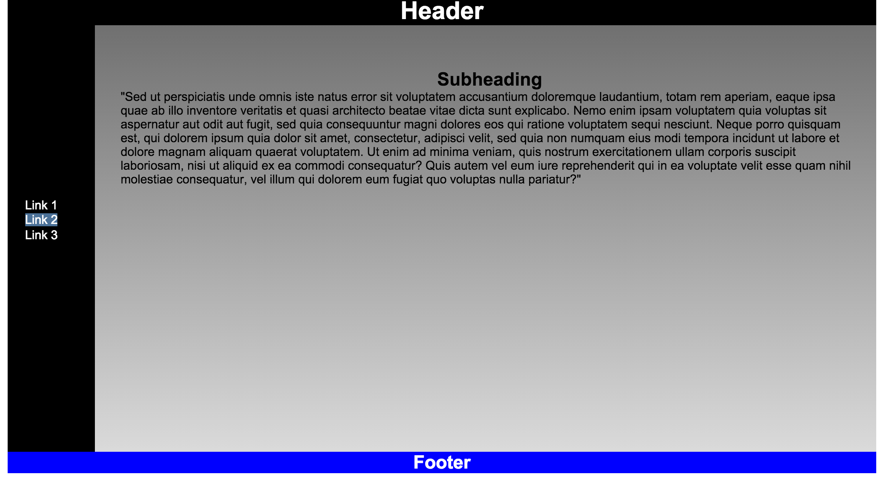

#Session 5 Semantic HTML Task

##Task 1 - Using Semantic HTML

The purpose of this task is to understand semantic HTML elements and also gain a greater understanding of using floats to lay out a HTML page. Furthermore you will be trying to focus on atomic component design. 

**Set up**

* Download the task from [here](https://github.com/joeappleton18/cda400/raw/master/sessions/week5/assets/session6.zip)
* Extract it inside your `internet_tech` folder
* The resulting folder will be called `session6`
* Open `index.html` within your favourite text editor and make sure you understand how the semantic HTML elements are laid out
* It should currently look like the below image in your browser:   

 

* Open up the `css/main.css` file and follow the steps in `/* .. */` comments
* These steps will guide you through the style sheet implementation. If done correctly your page should roughly resemble the below image
* If it does not look like the image below, make the necessary tweaks to your CSS

 

**Tip**   
Remember we use `margin: 0 auto` to align a block level element to the centre. 

##Task 2 - Horizontal Navigation Bar
Add a horizontal navigation bar to the `<header>` section of your page. Remember to use a `<ul>` list to group together the `<a>` elements.

##Task 3 - Links 

Add some pseudo classes to the links. 

##Task 4 - More CSS3 (Optional)

You should have already used the CSS3 properties `border` and `radius` at this point. This task requires you to implement at least 2 further CSS3 properties into your page.

You'll need to:

* Learn about the different types of CSS3 rules [Here is a great resource](http://code.tutsplus.com/tutorials/10-css3-properties-you-need-to-be-familiar-with--net-16417)
* Pick out some properties that interest you
* Implement them into your webpage 

##Task 5 - Validate Your HTML Code
Ensure your HTML code is valid using the [W3C Validator](https://validator.w3.org/). Don't forget to keep this habit up!
