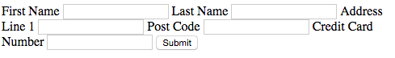

 

#
 Session 8 

###
 - [Assessment 1 Deadline ](#Assesment 1)

###
 - [Laying out Forms] (Laying out Forms)

#
Announcement - Assessment 1 Deadline

### - The submission link is now live on myCourse

### - Deadline 11:55pm Friday 11th December 2015 

###  - Late submission is possible up to 11:55 pm on Friday the 18th December 2015. However, assessments handed in late can only achieve a maximum grade of 40%

### - Assessment 1 is worth 50% of your final mark

 
##Laying out forms 

Forms are probably one of the more complex structures that you'll encounter in HTML. Therefor, making them layout correctly can prove somewhat tricky. 

It's important that we design usable and accessible forms:

* More people will be able to fill out your forms
* You'll get more customers and make more money
* Accessible forms lead to a better overall user experience
*  Well coded forms can easily utilise analytics packages such as [Google Analytics](https://www.google.co.uk/analytics/)

Consider the below form ([source code here](https://raw.githubusercontent.com/sirus21/Internet_technology/master/session8/practicals/session_8_raw_form.html)). As you can see by default it's completely unusable. 

In the next few pages we're going to go through a typical design process that would be used to layout a form.  

# Wireframe Mock Up 

It's tempting to jump straight in and start experimenting with HTML, designing the form as we go along. However, making design tweaks and experimenting with different layouts using HTML and CSS is time consuming. 

Therefore, it's common practice to plan the layout of HTML pages using a wire frame. A wire frame allows us to focus purely on the layout of our pages, filtering out the finer more time consuming design choices. Wire frames can be created:

* By Hand 
* Using a drawing tool such as photoshop
* [Using one of the many online wire framing tools](http://mashable.com/2010/07/15/wireframing-tools/#qIFvNLXIZgqt)

We can now attempt to layout our form to resemble the wire frame.

#The \<fieldset> and \<legend> elements

   
* The `<fieldset> .. </fieldset>` tag is used to group common form elements together

			<fieldset>  
				<label> First Name </label> <input type = "text" name="firstName">   
				<label> Last Name </label> <input type  = "text" name="lastName">   
 			</fieldset> 
* By default, `<fieldset> .. </fieldset>` is a block level element and has a border, you should know how to change this using CSS

<fieldset>  
		<label> First Name </label> <input type = "text" name="firstName">   
		<label> Last Name </label> <input type  = "text" name="lastName">   
</fieldset> 

* We can use the `<legend> .. </legend>` element to add a title to our `<fieldset>`   
		
		<fieldset>  
			<legend> Name </legend>
				<label> First Name: </label> <input type = "text" name="firstName">   
				<label> Last Name: </label> <input type  = "text" name="lastName">   
		</fieldset>
		
<fieldset>  
		<legend> Name </legend>
			<label> First Name: </label> <input type = "text" name="firstName">   
			<label> Last Name: </label> <input type  = "text" name="lastName">   
</fieldset>

###Exercise 1 
Use `<fieldset>`  and  `<legend>` to begin the process of laying out the form so it starts to resemble the  mockup. It should resemble the below:

<form>
    <!-- personal details -->  
      
    <fieldset> 
    <legend> Name: </legend>
        <label> First Name: </label> <input type = "text" name="firstName">
        <label> Last Name: </label> <input type  = "text" name="lastName">
    </fieldset>  
    
    <!-- address info --> 
    <fieldset> 
    <legend> Address: </legend>
        <label> Address Line 1 </label> <input type = "text" name="address1">
        <label> Post Code </label> <input type  = "text" name="postCode">
    </fieldset>

    
        <!-- payment information -->
    <fieldset>
    	 <legend> Payment: </legend>
        <label> Card Number: </label> <input type = "text" name="cardNo">
    </fieldset>
        
        <input type="submit">
</form>    

# `
` tags can be used to create separate lines

Input elements and labels are inline, therefore we need to wrap them in a block level elements so they sit on their own line. The W3C recommend to wrap form elements in `
` tags in order create new lines. 

	<fieldset> 
		<legend> Name </legend>
	   
 <label> First Name: </label> <input type = "text" name="firstName"> 

	   
<label> Last Name: </label> <input type  = "text" name="lastName"> 

	</fieldset>  
	

 <fieldset> 
 		<legend> Name </legend>
       
 <label> First Name: </label> <input type = "text" name="firstName"> 

       
<label> Last Name: </label> <input type  = "text" name="lastName"> 

</fieldset>  

###Exercise 2: 
Add `
` tags to your form to group together form elements so that they sit on their own line.

#
Basic CSS For Forms 

 
* In order to style this form we need to give the form and id `<form id="payment">`
* We can now style this specific form using decent selectors e.g. `#payment legend {text-align: centre;} `

**Exercise 3:**  Let's add some styles to our form:

* Include a blank external style sheet
* Currently the form is too wide, let's give it a `width:500px`. Remember the `<form>` has an id attribute. We can use this to add styles
* Align the `<legend>` text to the centre, remember to use  `#payment legend {text-align: centre;} `
* Ok, we're getting there, but the labels and inputs are not aligned with each other. At the moment the text within the `<label>` element is controlling the placement of the inputs. 
* To solve this problem we need to `float` the text inputs to the right. The problem is we can't just say `#payment input {float:right}` because our button is also a input and we don't want to style this yet. We need to just target `<input type="text">` in order to do this we can use the following CSS declaration:

		#payment input[type="text"] {
 			float: right;
		}
		
* You can change the `input[type="<insert type>"]` to whatever type of input you want to target
* Your form probably is a little wide, adjust the css `width` property so it resembles the following:

<form id="payment">
         
    <fieldset> 
    <legend> Name </legend>
        
 <label> First Name </label> <input type = "text" name="firstName"> 

        
<label> Last Name </label> <input type  = "text" name="lastName">

    </fieldset>  
    
       <fieldset> 
    <legend> Address </legend>
        
<label> Address Line 1 </label> <input type = "text" name="address1"> 

        
<label> Post Code </label> <input type  = "text" name="postCode">

    </fieldset>
	    
    <fieldset>
    	 <legend> Payment </legend>
        <label> Card Number </label> <input type = "text" name="cardNo">
    </fieldset>
        
      <input type="submit">
</form>    

#
Further Styling Of Inputs

* You can change the can border colour and width of text inputs by implementing the border property 
			
		#payment input[type="text"] {
				border: 1px solid green;    
		}
	
* We can style our input button just like any other HTML element. Remember, we can change the text on the button from submit to anything we like by implementing the attribute `value`  e.g.  `<input type="submit" value="GO!">`. 

		 			
		#payment input[type="submit"]  {
    			border-radius: 4px; 
    			border: solid 1px black; 
    			font-size:20px;
    			
			    
		}
		
* <input type="submit" value="Press Me!" style=" border-radius: 4px; font-size:20px;border: solid 10px black 1px;">  

#
Laying Out/Styling Check And Radio Boxes

* We can use `<fieldset>` and  optional  `<legend>` to group together our related `<input>`'s 
* Just like with any other input we can use `
` tags to create a new line

<fieldset>
<legend> Transport </legend>

<input type="checkbox" name="vehicle" value="Bike">I have a bike

<input type="checkbox" name="vehicle" value="Car">I have a car 

</fieldset>

	<fieldset>
		<legend> Transport </legend>
		
<input type="checkbox" name="vehicle" value="Bike">I have a bike

		
<input type="checkbox" name="vehicle" value="Car">I have a car 

		</fieldset>
	</form>

#
Styling Valid/Invalid Inputs

Remember in the last session, we looked at just how easy it is to validate forms using html5:

 	<input type="text" name="first_name" required>

You can specifically target valid and invalid form fields using the pseudo selector `:valid` and `:invalid` :

	input:invalid {
  		border: solid red;
	}

	input:valid {
  		border:solid green;
	}
	
If you only want to display validation formatting when the form field is in focus
(someone has clicked on it), we can use the `focus:` selector along with `:invalid` or `:valid` :

	input:focus:valid { 
	          border:solid green;
	 }

#
Weekly Task - Laying out Forms


The purpose of this task is to increase your understanding of how to layout forms. 

#1 Setup

Create the file `form_task.html` and place it in your internet_tech/session_8 folder. Copy the starting HTML source code from here `https://raw.githubusercontent.com/sirus21/Internet_technology/master/session8/practicals/session_8_main_task.html`
and past it into form_task.html .

#2 Lay out the form

As you can see, currently no consideration has been given to the layout of the form. Using the techniques we covered in this lecture, your task is to lay the form out. As a minimum you should:

* Use `
` tags to divide inputs and labels into related lines
* Use `fieldset` and `legend` to group together common inputs
* Ensure inputs and labels are aligned correctly
* Style the submit button

#3 HTM5 validation
Apply an HTML5 validation to your form and use the `:invalid` or `:valid`  pseudo class so users know if there input is valid.  

#4 Validate your HTML
Make sure your HTML is valid.

#5 Update your learning log - for the last time
Make sure you update your learning log for the final time.

	
