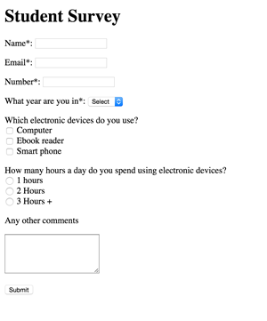

#Weekly Task - HTML5 Forms 

The purpose of this task is to increase your understanding of HTML5 forms and validation. Today we'll be focusing on HTML only, there will be no need to style the forms using CSS 

We'll also be considering the legal requirements of collecting personal information

#1 IMPORTANT - IOC Considerations 

For the TCA you'll be required to take in a few  bits of preprepared information.  One of which will be legal the legal considerations of  a company collecting information 

Please consider your data protection requirements, setting up a website. To make this more realistic, please write it from the following perspective:

- You own a small web development business 
- You're making a website to promote your business to clients. You'll have a form on the website generating business leads.

**Write no more than 3 paragraphs summarising you data protection requirements:**

- You can use [The IOC check list](https://ico.org.uk//for-organisations/improve-your-practices/data-protection-toolkit/index.html) to help you

- When you're done, check with your tutor that you work is sufficient. **Rememeber**, store it in a safe place, you'll need it for the TCA. 

 
#2 Creating a form 

#2.1 Setup 

- Create a `week8` folder on your `u` drive
- Within your `week8` folder create a `index.html` file and populate with the basic HTML5 tags.  You can use the [HTML5 Template](https://github.com/joeappleton18/cda400/edit/master/sessions/week2/in_class_demos/html5_template.html) as a starting point

#2.2 Task 

>> Figure 1, html form 

- Create the form in Figure 1, **we're not focusing on css this week**
- Consider the following:
	- `
` tags should be used to create separate lines
	-  Each `<input>` should have a label with a `for` attribute 

- Your form **must** comply to the below specification
-  Use `
` tags to separate inputs
- The form should have a method of post and an action sending it to `google.com`
- **Note**, the input names are the names attributed to each input, they are independent of the information displayed to the user. For example:

`<input type='text' name='name'>`

| Input Name | Type	|Value(s)  | Validation |
| -----------|------|-------| -----------|
|  name 	   | text | -		 |  required  |
|  email     | email| -     |  required
|  year      | select| 1,2,4|  required |
|  electronic_devices|  Check Box    |     computer, ebook, phone | - |
|hours  | radio box | 1, 2 ,3, 3+ | - |
|submit | submit | submit  | - |
